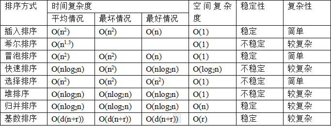

## 1.时间复杂度

> 时间复杂度是用来估计算法运行时间的一个式子

1.2.1算法的好处与坏

1.2.2基本操作执行次数

​	O(1)<O(logn)<O(n)<O(nlogn)<O(n的平方)<<O(n的平方logn)<O(n的三次方)

1.2.3 渐进时间复杂度

| 1                                          | 2                  |
| ------------------------------------------ | ------------------ |
| 如果运行时间是常数量级，则用常数1表示      | 确定问题规模n      |
| 只保留时间函数中的最高阶项                 | 循环减半过程logn   |
| 如果最高阶项存在，则省去最高阶项前面的系数 | k层关于n的循环 n^2 |

## 2.空间复杂度

###  1.什么是空间复杂度

用来评估算法内存占用的大小,往往是"空间换时间"公式为S(n)=O(f(n)),其中n为问题的规模,f(n)为算法所占用存储空间的函数

| 注意点                            |
| --------------------------------- |
| 算法使用了几个变量:O(1)           |
| 算法使用了长度为n的有一维列表O(n) |
| 算法使用了m行n列的二维列表O(mn)   |

### 2.空间复杂度的计算

| 常见的几种情形                   | 空间复杂度 |
| -------------------------------- | ---------- |
| 常量空间:k                       | O(1)       |
| 线性空间:kn                      | O(n)       |
| 二维空间:kn^2                    | O(n^2)     |
| 递归空间:递归深度为n(函数调用栈) | O(n)       |

**注意**

> k为常量,n为时间


##  3.常见的算法

### 1.汉诺塔问题

```python
#!/usr/bin/env python3
# -*- coding: utf-8 -*-


def func(n, a, b, c):
    if n == 1:
        print(a, '-->', c)
    elif n > 1:
        func(n - 1, a, c, b)
        print(a, '-->', c)
        func(n - 1, b, a, c)
    else:
        print("n值输入错误")


if __name__ == '__main__':
    func(3,'A','B','C')

```


###  2.二分查找

```python
#!/usr/bin/env python3
# -*- coding: utf-8 -*-


def binarySearch(arr, l, r, x):
    """返回 x 在 arr 中的索引，如果不存在返回 -1"""
    # 基本判断
    if r < l:
        return -1
    mid = int(l + (r - l) / 2)
    # 元素整好的中间位置
    if arr[mid] == x:
        return mid
        # 元素小于中间位置的元素，只需要再比较左边的元素
    elif arr[mid] > x:
        return binarySearch(arr, l, mid - 1, x)
        # 元素大于中间位置的元素，只需要再比较右边的元素
    else:
        return binarySearch(arr, mid + 1, r, x)


if __name__ == '__main__':
    arr = [2, 3, 4, 10, 40]
    x = 10
    result = binarySearch(arr, 0, len(arr) - 1, x)
    tips = f"元素在数组中的索引为{result}" if result != -1 else "元素不在数组中"
    print(tips)
```

**注意:**

> 二分查找的时间复杂度为O(log2n),线性查找的时间复杂度为O(n),所以整体来说二分查找要快于线性查找


## 4.常见排序算法



 ### 1.冒泡排序

列表每两个相邻的数,如果前面的比后面的大,则交换两个数

一趟排序完成,则无序区减少一个数,有序区增加一个数

```python
#!/usr/bin/env python3
# -*- coding: utf-8 -*-

def bubbleSort(arr):
    n = len(arr)
    # 遍历所有数组元素
    for i in range(n):
        # Last i elements are already in place
        for j in range(n - i - 1):
            if arr[j] > arr[j + 1]:
                arr[j], arr[j + 1] = arr[j + 1], arr[j]


if __name__ == '__main__':
    arr1 = [64, 34, 25, 12, 22, 11, 90]
    bubbleSort(arr1)
    print(f"排序后的数组:{arr1}")
```

注意

> 时间复杂度为O(n2),空间复杂度为O(1),不稳定


### 2.选择排序

```python
#!/usr/bin/env python3
# -*- coding: utf-8 -*-


def select_sort(arr):
    n = len(arr)
    for i in range(n):
        mix_index = i
        for j in range(i + 1, n):
            if arr[mix_index] > arr[j]:
                mix_index = j
        arr[i], arr[mix_index] = arr[mix_index], arr[i]


if __name__ == "__main__":
    arr1 = [64, 34, 25, 12, 22, 11, 90]
    select_sort(arr1)
    print(f"排序后的数组:{arr1}")

```


### 3.插入排序

1.起始位从1开始

2.a[i]值抽离出来与索引小于i的值进行比较,将a[1]插入到属于自己的位置

3.里程循环判断条件为j的值到0,且a[j]要大于原始的a[i]


```python
#!/usr/bin/env python3
# -*- coding: utf-8 -*-


def insert_sort(arr):
    for i in range(1, len(arr)):
        key = arr[i]
        j = i - 1
        while j >= 0 and arr[j] > key:
            arr[j + 1] = arr[j]
            j -= 1
        arr[j + 1] = key


if __name__ == "__main__":
    arr1 = [64, 34, 25, 12, 22, 11, 90]
    insert_sort(arr1)
    print(f"排序后的数组:{arr1}")

```


### 4.堆排序


### 5.归并排序 


### 6.希尔排序


### 7.计数排序


 ### 8.基数排序


​       

​        

​       